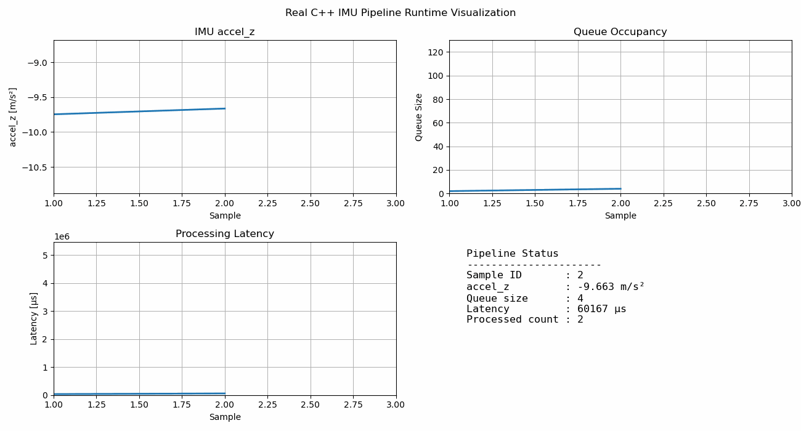

# Modern C++ IMU Sensor Pipeline

This project is a small C++17 sensor-processing pipeline that simulates how IMU data can be collected, passed between threads, processed, and logged in real time.

The main goal of the project is to demonstrate clean C++ design, safe multi-threading, and basic real-time sensor data handling.

---

## Overview

The pipeline has three main parts:

1. **IMU Producer Thread**
   Generates simulated IMU acceleration data at 100 Hz.

2. **Thread-Safe Queue**
   Stores sensor readings safely between the producer and consumer threads.

3. **Logger / Consumer Thread**
   Reads the sensor data asynchronously, processes it, and measures timing information using `std::chrono`.

```text
┌──────────────┐       ┌──────────────┐       ┌──────────────┐
│  IMU Thread  │──────▶│ Sensor Queue │──────▶│  Logger      │
│  Producer    │       │ Thread-safe  │       │  Consumer    │
│  100 Hz      │       │ mutex + cv   │       │  Async       │
└──────────────┘       └──────────────┘       └──────────────┘
```

The pipeline uses atomic variables to start and stop the system safely.

---

## What This Project Shows

* Real-time-style IMU data generation
* Producer-consumer architecture
* Safe communication between threads
* Thread-safe queue implementation
* Use of mutexes and condition variables
* Atomic flag for safe pipeline shutdown
* Basic timing measurement with `std::chrono`
* CMake-based build workflow
* Modern C++17 coding style

---

## Concepts Used

| C++ / Software Concept |
| ---------------------- |
| Modern C++17           |
| Threads                |
| Mutexes                |
| Condition variables    |
| Atomic variables       |
| RAII                   |
| Move semantics         |
| Templates              |
| `std::optional`        |
| `std::chrono`          |
| CMake                  |

---

## Project Structure

```text
.
├── CMakeLists.txt
├── main.cpp
├── sensor_pipeline.hpp
└── README.md
```

---

## Build Instructions

### Requirements

* CMake 3.16 or newer
* C++17 compatible compiler
* Linux recommended

---

### Build and Run

```bash
mkdir build
cd build

cmake ..
make -j$(nproc)

./sensor_pipeline
```

Example output:

```text
[INFO] Pipeline running at 100 Hz
[INFO] Processed 300 readings
```

---

## Possible Extensions

This project can be extended into more advanced sensor-processing systems, such as:

* unit testing with GoogleTest
* AddressSanitizer and ThreadSanitizer support
* CPU and heap profiling
* sensor fusion pipelines
* UAV telemetry processing
* radar or SDR data pipelines
* embedded Linux sensor applications
* real hardware IMU integration
* Kalman filtering
* UDP/TCP data streaming
* multi-producer and multi-consumer systems

---

## Purpose

This project was built as a portfolio project to practice modern C++17, multi-threading, synchronization, and real-time-style sensor data processing.

It is especially relevant for embedded systems, robotics, sensor software, radar processing, and measurement system applications.

---
## Runtime Visualization and Animation

The C++ pipeline logs runtime data into a CSV file called `pipeline_log.csv`. A small Python visualization script reads this file and creates an animated GIF of the pipeline behavior.

The animation shows how the sensor data moves through the system during execution:

* simulated IMU `accel_z` data
* queue occupancy between producer and consumer threads
* processing latency in microseconds
* current pipeline status, including sample ID, queue size, latency, and processed count



The GIF should animate directly inside the GitHub README when the file is uploaded correctly and placed in the same folder as `README.md`.

This makes the project easier to understand because it shows the runtime behavior of the multi-threaded pipeline, instead of only showing terminal output.

---

## Visualization Workflow

```text
C++ IMU Pipeline
        │
        ▼
pipeline_log.csv
        │
        ▼
Python Visualization Script
        │
        ▼
cpp_pipeline_animation.gif
```

To run the visualization script:

```bash
python visualize_pipeline.py
```

The output file is:

```text
cpp_pipeline_animation.gif
```
